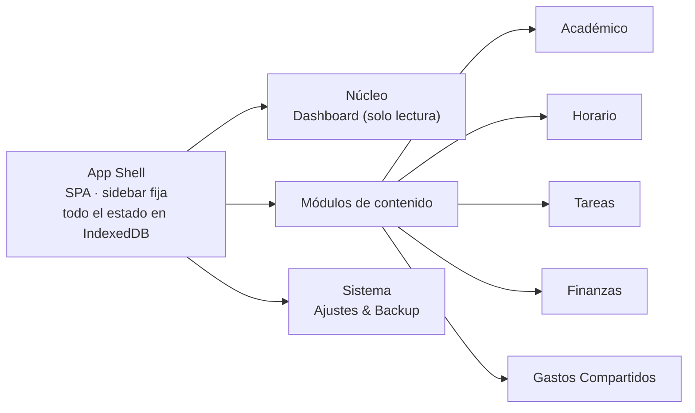

# Blueprint — Organizador Local-First

Arquitectura, esquemas y decisiones técnicas para el organizador académico y personal. Documento de referencia: consultar la sección correspondiente antes de tocar un módulo por primera vez. Roadmap de implementación en [`ROADMAP.md`](./ROADMAP.md); tipos ya definidos en [`../src/types/models.ts`](../src/types/models.ts).

## Resumen

No hay servidor. Materias, horarios, tareas, gastos y liquidaciones entre amigos se leen y escriben en IndexedDB, dentro del navegador del usuario. Eso resuelve privacidad y velocidad de un plumazo — sin latencia de red, sin cuenta que crear, sin datos de terceros en tránsito — pero traslada al frontend responsabilidades que normalmente vive un backend: validar lo que entra, versionar el esquema para no romper datos viejos, y ofrecer un mecanismo de respaldo tan bueno que sustituya con confianza a una base de datos remota.

---

## 1. Arquitectura de navegación (UX/UI)

Siete destinos, un dashboard de lectura y una puerta de emergencia (el backup) siempre a mano.

### Sidebar, no pestañas

Con cinco módulos más Dashboard y Ajustes, una barra de pestañas horizontal ya está en el límite: en pantallas de 1280px reales empieza a truncar etiquetas o a envolver en dos líneas. Una barra lateral fija escala a más ítems sin rediseño, admite ícono + etiqueta en desktop y colapsa a solo-ícono cuando el usuario la achica, y le da al usuario un ancla espacial constante ("Finanzas siempre vive en el tercer ícono") que una barra de pestañas que se reordena no ofrece.

El orden no es alfabético, es por frecuencia de uso esperada: **Dashboard** (entrada) → **Tareas** (consulta diaria) → **Horario** (consulta diaria, cambia poco) → **Académico** (consulta semanal/mensual) → **Finanzas** (consulta semanal) → **Gastos Compartidos** (uso puntual, por evento) → separado por una línea al pie → **Ajustes & Backup** (no es un módulo de contenido, es la red de seguridad de todos los demás).



*La sidebar agrupa en tres capas con distinto propósito (lectura, trabajo, sistema) — eso ordena tanto el menú como el modelo mental del usuario.*

### El dashboard es de lectura, no de edición

Sus widgets — próxima clase, tareas que vencen en 48 h, resumen de gasto del mes contra presupuesto, promedio académico actual, débitos automáticos próximos y un mini-pomodoro — son todos de un vistazo, y cada uno lleva a su módulo si el usuario quiere actuar. Esto evita que el Dashboard se convierta en un octavo módulo con su propia lógica de edición para mantener.

### Captura rápida: un FAB con memoria de contexto

Un botón flotante persistente (visible en los cinco módulos de contenido, no en Ajustes) abre un formulario mínimo de captura — tarea, gasto o idea — sin cambiar de pantalla. La única inteligencia que vale la pena construir: si el FAB se abre estando en Finanzas, precarga el formulario de movimiento; en cualquier otro lado, abre tarea rápida por default.

### Responsive: de sidebar a barra inferior

En desktop, la sidebar es fija y colapsable a solo-íconos. En mobile, siete destinos no entran en una barra inferior legible — el límite práctico son cuatro o cinco slots. Resolución: **Dashboard, Tareas, Horario** fijos (consulta diaria) + un cuarto slot **"Más"** que despliega Académico, Finanzas, Gastos Compartidos y Ajustes en una hoja modal. El FAB se mantiene flotante sobre la barra inferior en las tres primeras pestañas.

### Primer uso, sin login

La primera pantalla ofrece explícitamente dos caminos — *Empezar de cero* o *Importar un respaldo (.json)* — y luego un recordatorio discreto y persistente (un punto de color en el ícono de Ajustes, no un modal invasivo) cuando pasen más de catorce días sin una exportación. "Borrar los datos del navegador" debe sentirse, desde el primer minuto, como una acción con consecuencias reales.

---

## 2. Los tres desafíos técnicos

### 2.1 — Exportación a Excel estilizado

No es "SheetJS o ExcelJS": no compiten en el mismo terreno para este caso de uso. SheetJS (`xlsx`) es excelente *leyendo* casi cualquier formato de planilla, pero su edición gratuita (Community Edition) tiene soporte limitado para *escribir* estilos ricos de celda — colores de fondo, bordes — eso vive detrás de la versión Pro paga o de forks comunitarios no oficiales. ExcelJS está diseñado desde su núcleo para escribir estilos (fuentes, rellenos, bordes, formatos numéricos, anchos de columna) tanto en Node como en navegador, y es la opción con la que "Excel estilizado y bien formateado" se logra sin depender de una licencia paga.

| Criterio | SheetJS (xlsx) CE | ExcelJS |
|---|---|---|
| Escritura de colores/rellenos por celda | Limitada — requiere Pro | Nativa |
| Lectura de .xlsx / .csv | Excelente | Buena |
| Instalación | Recomiendan su propio CDN, no el registro npm estándar | npm estándar |
| Uso en navegador | Sí | Sí, con bundler (Vite) |

**Recomendación: una sola dependencia para todo — ExcelJS para leer y escribir .xlsx.**

```ts
// src/features/academico/exportMaterias.ts
import ExcelJS from 'exceljs';
import type { Materia, EstadoMateria } from '../../types/models';

const COLOR_ESTADO: Record<EstadoMateria, string> = {
  Aprobado:  'FF2F8F5B',
  Cursando:  'FFB1791A',
  Regular:   'FF2D7DA6',
  PorCursar: 'FF8B93A1',
};

export async function exportarMateriasAXlsx(materias: Materia[]) {
  const wb = new ExcelJS.Workbook();
  const ws = wb.addWorksheet('Materias', { views: [{ state: 'frozen', ySplit: 1 }] });

  ws.columns = [
    { header: 'Materia',   key: 'nombre', width: 32 },
    { header: 'Año',       key: 'anio',   width: 8  },
    { header: 'Hs/semana', key: 'hsSem',  width: 12 },
    { header: 'Nota',      key: 'nota',   width: 8  },
    { header: 'Estado',    key: 'estado', width: 14 },
  ];
  ws.getRow(1).font = { bold: true, color: { argb: 'FFFFFFFF' } };
  ws.getRow(1).fill = { type: 'pattern', pattern: 'solid', fgColor: { argb: 'FF17202B' } };

  materias.forEach(m => {
    const row = ws.addRow({
      nombre: m.nombre, anio: m.anioCursado, hsSem: m.cargaHoraria.semanal,
      nota: m.nota ?? '—', estado: m.estado,
    });
    row.getCell('estado').fill = { type: 'pattern', pattern: 'solid', fgColor: { argb: COLOR_ESTADO[m.estado] } };
    row.getCell('estado').font = { color: { argb: 'FFFFFFFF' } };
  });
  ws.autoFilter = 'A1:E1';

  const buffer = await wb.xlsx.writeBuffer();
  const blob = new Blob([buffer], { type: 'application/vnd.openxmlformats-officedocument.spreadsheetml.sheet' });
  descargarBlob(blob, `materias-${Date.now()}.xlsx`); // URL.createObjectURL + <a download>
}
```

> **Nota de localización.** En configuración regional Argentina, Excel exporta CSV separado por `;` (no `,`) y usa `,` como separador decimal. El importador de CSV debe detectar el delimitador automáticamente y nunca asumir `.` como separador decimal al parsear la columna Nota — de lo contrario "8,50" se lee como texto o como 850. Usar **PapaParse** para el parseo: resuelve la detección de delimitador y el manejo de comillas de forma más robusta que escribirlo a mano.

### 2.2 — Fusión de celdas en la grilla de horario

El error de diseño más común: guardar el horario como una matriz de celdas con un booleano "ocupada" y un flag "fusionar con la de abajo". Eso obliga a mantener consistencia manual cada vez que se edita un bloque.

**La alternativa correcta: el dato nunca sabe que existen celdas fusionadas.** Cada bloque se guarda como un evento con hora de inicio y fin (`14:00 → 18:00`) y la fusión visual se *calcula* en el render, no se almacena.

Con CSS Grid: las columnas son los días, las filas son franjas fijas de tiempo (30 minutos, para admitir clases que arrancan en punto o y media). Cada bloque recibe `grid-row: inicio / span N`, donde `inicio` sale de la hora de apertura de la grilla y `N` sale de la duración dividida por el tamaño de la franja. Cuando dos bloques se solapan el mismo día — típico de un cambio de comisión — se les asigna un **carril** (lane) mediante un barrido de interval partitioning (el mismo algoritmo goloso de los calendarios tipo Google Calendar), repartiendo el ancho de la columna entre los carriles activos en ese rango horario.

Ejemplo: un bloque de Álgebra de 09:00 a 12:00 los lunes ocupa una sola celda visual con `grid-row: span 6`. Dos comisiones de Física que se solapan de 10:30 a 11:00 los miércoles se muestran lado a lado en dos carriles. Ninguno de los dos casos está "marcado" en los datos — ambos se derivan de `horaInicioMin` / `horaFinMin` en el render.

```ts
// src/features/horario/layoutSemana.ts — pseudocódigo
function layoutDia(bloquesDelDia, aperturaMin: number, slotMin: number) {
  // 1) posición y tamaño en la grilla, a partir de la hora
  const conPosicion = bloquesDelDia.map(b => ({
    ...b,
    filaInicio: Math.floor((b.horaInicioMin - aperturaMin) / slotMin) + 1,
    filaSpan:   Math.ceil((b.horaFinMin - b.horaInicioMin) / slotMin),
  }));

  // 2) asignación de carriles: barrido goloso por hora de inicio
  const carriles: number[] = []; // carriles[i] = hora en que ese carril queda libre
  for (const b of conPosicion.sort((a, b) => a.horaInicioMin - b.horaInicioMin)) {
    let i = carriles.findIndex(libreDesde => libreDesde <= b.horaInicioMin);
    if (i === -1) i = carriles.length;
    carriles[i] = b.horaFinMin;
    b.carril = i;
  }
  const totalCarriles = carriles.length;
  return conPosicion.map(b => ({
    ...b, anchoPct: 100 / totalCarriles, offsetPct: b.carril * (100 / totalCarriles),
  }));
}
```

### 2.3 — Liquidación óptima de gastos compartidos

El problema tiene dos partes independientes.

**Parte contable:** convertir una lista de compras en un balance neto por persona (lo que pagó, menos lo que le correspondía consumir). La exclusión por ítem ("Sofía no toma alcohol") se resuelve en el *modelo*, no en el algoritmo: cada gasto guarda su propia lista de participantes, así que excluir a alguien de una compra puntual es simplemente no incluirlo en ese array.

**Parte de optimización:** reducir esos balances a la menor cantidad de transferencias. El mínimo matemático exacto es NP-difícil (equivalente a partición de subconjuntos), pero eso es una nota al pie, no un obstáculo: el algoritmo goloso que empareja en cada paso al mayor acreedor con el mayor deudor —el mismo enfoque de Splitwise— converge en como máximo *N−1* transferencias para N personas, corre en `O(N log N)`, y en la práctica coincide con el óptimo en la enorme mayoría de los casos reales de un grupo de amigos.

```ts
// src/features/gastos-compartidos/liquidar.ts
import type { Transferencia } from '../../types/models';

function liquidar(balances: Record<string, number>): Transferencia[] {
  // balances, ej: { Pablo: -1200, Tomás: 800, Sofía: 400 }
  const acreedores = Object.entries(balances).filter(([, v]) => v > 0).sort((a, b) => b[1] - a[1]);
  const deudores   = Object.entries(balances).filter(([, v]) => v < 0).sort((a, b) => a[1] - b[1]);
  const transferencias: Transferencia[] = [];
  let i = 0, j = 0;

  while (i < acreedores.length && j < deudores.length) {
    const [acreedor, credito] = acreedores[i];
    const [deudor, deuda]     = deudores[j];
    const monto = Math.min(credito, -deuda);

    transferencias.push({ de: deudor, a: acreedor, monto: Math.round(monto * 100) / 100 });
    acreedores[i][1] -= monto;
    deudores[j][1]   += monto;

    if (acreedores[i][1] < 0.01) i++;
    if (deudores[j][1]  > -0.01) j++;
  }
  return transferencias;
}
```

**Ejemplo — asado de tres, con Sofía excluida de la birra:**

| Ítem | Pagó | Monto | Participantes |
|---|---|---|---|
| Carne y verdura | Pablo | $21.000 | Pablo, Tomás, Sofía |
| Birra | Tomás | $9.000 | Pablo, Tomás |

Balance neto: Pablo pagó $21.000 y debía $11.500 → **le deben $9.500**. Tomás pagó $9.000 y debía $11.500 → **debe $2.500**. Sofía pagó $0 y debía $7.000 → **debe $7.000**.

→ 2 transferencias: **Sofía → Pablo $7.000** y **Tomás → Pablo $2.500**. No hace falta que Sofía y Tomás se transfieran nada entre sí.

---

## 3. Esquemas de datos

Los tipos completos ya están escritos en [`src/types/models.ts`](../src/types/models.ts) — no reinventarlos, extenderlos ahí. Esta sección da el contexto de cada uno.

- **Materia**: nombre, año, carga horaria, estado (`PorCursar | Cursando | Regular | Aprobado`), parciales con peso, correlativas.
- **BloqueHorario**: `materiaId`, día, `horaInicioMin`/`horaFinMin` en minutos desde 00:00 (nunca "celda fusionada", ver sección 2.2).
- **Tarea / Proyecto**: tipo (`academica | personal | proyecto | idea`), estado Kanban, prioridad, fecha límite, `pomodorosCompletados`.
- **MovimientoFinanciero / SuscripcionRecurrente**: monto, categoría, fecha o día del mes fijo para recurrentes.
- **EventoCompartido**: `participantes` + `gastos`, cada gasto con su propia lista de participantes (ver sección 2.3).
- **BackupCompleto**: el objeto que viaja en el JSON de exportación. Lleva `schemaVersion` — campo no negociable. Cada importación corre primero por una función `migrarBackup(json)` que mira `schemaVersion` y aplica transformaciones incrementales (v1→v2, v2→v3…) antes de tocar la base local, y luego por validación Zod antes de escribir una sola fila. Un archivo que falla la validación se rechaza entero, nunca se mezcla parcialmente con los datos existentes.

---

## 4. Stack tecnológico recomendado

| Capa | Elección | Por qué esta y no otra |
|---|---|---|
| Framework | React 18 + TypeScript + Vite | Build rápido, tipado fuerte para validar los esquemas de la sección 3 en compilación, ecosistema más amplio de drag-and-drop y componentes accesibles. |
| Persistencia | Dexie.js sobre IndexedDB | API con promesas sobre el verboso IndexedDB nativo; `dexie-react-hooks` (`useLiveQuery`) re-renderiza la UI sola cuando cambian los datos, sin duplicar estado en un store global. |
| Estado de UI | Zustand | Solo para lo que *no* es dato persistente: pestaña activa, filtros temporales, estado del FAB. Los datos de negocio viven en Dexie, no en el store. |
| Estilos | Tailwind CSS + shadcn/ui (Radix) | Componentes accesibles por defecto (foco, roles ARIA) que Tailwind solo no da; modo oscuro vía la estrategia de clase de Tailwind. |
| Drag & drop | dnd-kit | Accesible por teclado, sin dependencias pesadas — lo usan el Kanban de Tareas y la edición de bloques del Horario. |
| Gráficos | Recharts | Suficiente para distribución de gastos por categoría y presupuesto vs. real; no hace falta D3 crudo para este alcance. |
| Excel | ExcelJS + file-saver | Ver sección 2.1 — única librería que escribe estilos de celda sin licencia paga. |
| CSV | PapaParse | Detección de delimitador (`;` vs `,`) y manejo de comillas/encoding. |
| Fechas | date-fns | Tree-shakeable — solo se empaquetan las funciones usadas. |
| Validación | Zod + React Hook Form | El mismo esquema Zod valida formularios *y* el JSON/CSV importado antes de escribir en Dexie. |
| Offline shell | vite-plugin-pwa | Cachea el *código* de la app; los *datos* ya están offline por diseño en IndexedDB — son dos capas de "sin conexión" distintas. |

> **Alternativa de framework.** Vue 3 + Pinia + VueUse cubre el mismo terreno igual de bien; la inclinación por React acá es de ecosistema (dnd-kit, shadcn/ui, comunidad de Dexie con más ejemplos en React), no una limitación técnica de Vue.

> **Detalle que se pasa por alto.** Pedir `navigator.storage.persist()` al usuario reduce el riesgo de que el navegador borre IndexedDB bajo presión de espacio en disco.

---

## 5. Funciones adicionales — cómo encajarlas sin inflar el producto

Las tres suman valor real si viven *dentro* de un módulo existente, no como un ítem nuevo en la sidebar.

**Calculadora de nota necesaria.** No es un módulo, es un botón dentro de la ficha de cada Materia: *"¿Qué necesito para aprobar?"*.

```
notaNecesaria = (notaObjetivo − Σ(parcial.nota × parcial.peso)) / pesoFinal
```

Si el resultado supera la escala máxima, avisar que ya no es matemáticamente posible alcanzar ese objetivo solo con el final, y mostrar qué nota mínima en un parcial pendiente lo haría posible, si queda alguno.

**Temporizador de enfoque (Pomodoro).** Widget flotante minimizable anclado a la tarea seleccionada en el To-Do. Cada sesión completa incrementa `pomodorosCompletados` en esa tarea (ya está en `models.ts`) — dato opcional, nunca obligatorio.

**Recordatorios y notificaciones — con una advertencia honesta.** Sin backend no existe "push" garantizado con la app cerrada en todos los navegadores. La *Notification Triggers API* de Chrome quedó como propuesta experimental sin adopción cruzada — no prometerle al usuario "te vamos a avisar aunque tengas todo cerrado". Implementación de dos niveles:

- **Nivel garantizado:** al abrir la app, al volver a la pestaña (`visibilitychange`) y en un intervalo mientras sigue abierta, revisar tareas/débitos próximos y disparar `new Notification()` si algo cae en las próximas 48 h. Funciona en cualquier navegador con la pestaña abierta.
- **Nivel de mejor esfuerzo:** con la PWA instalada en Chrome/Android, la *Periodic Background Sync API* permite un chequeo ocasional en segundo plano. Implementar como mejora progresiva; no prometerlo en el copy — en iOS Safari y Firefox no ocurre.

---

## 6. Riesgos y consideraciones finales

- **Pérdida de datos.** El recordatorio de backup (sección 1) es la mitigación de base. Como mejora opcional, la File System Access API (Chrome/Edge) permite auto-export periódico a una carpeta elegida por el usuario — mencionarlo como mejora, no como base: Safari y Firefox no la soportan.
- **Migraciones de esquema.** Versionar desde la Fase 0 (ver `ROADMAP.md`) no es previsión excesiva: es lo que evita que un cambio de forma más adelante rompa un backup exportado antes.
- **Localización numérica.** La coma decimal y el separador de miles de Argentina (sección 2.1) hay que validarlos en toda la app que toque números — notas, montos — no solo en el importador de CSV.
- **Privacidad real, sin letra chica.** Sin backend no hay términos de servicio de datos que redactar, pero sí hay que comunicar bien, sin tecnicismos, que borrar los datos del navegador borra todo lo que no se haya exportado.
